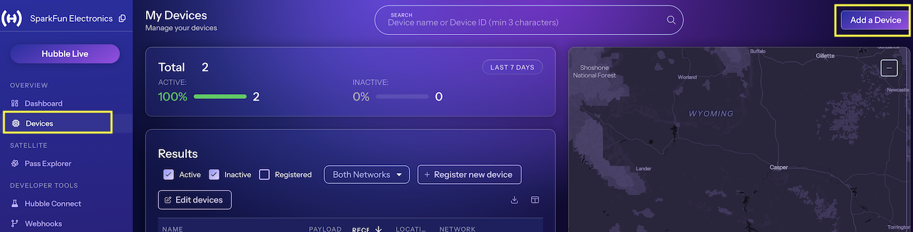
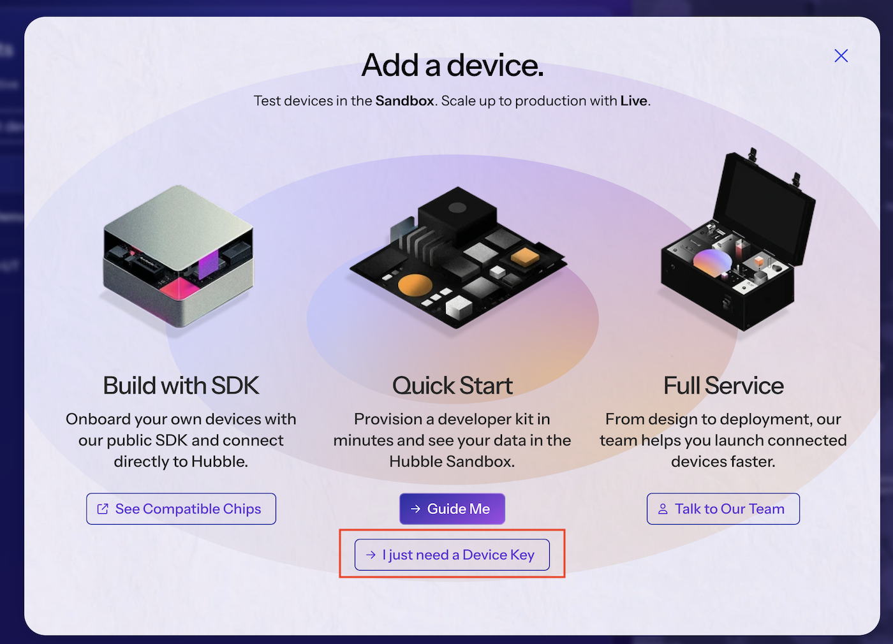
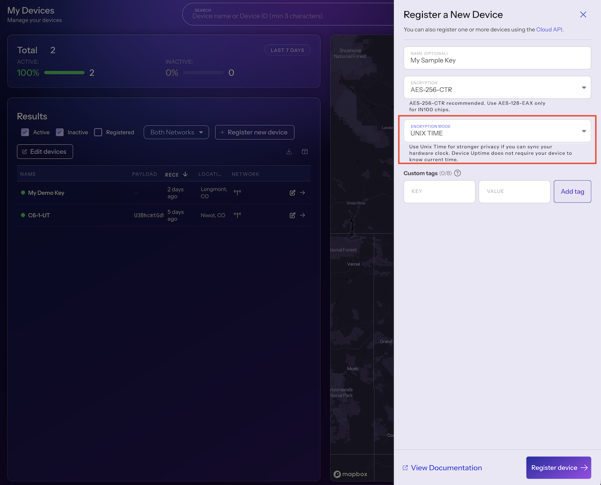
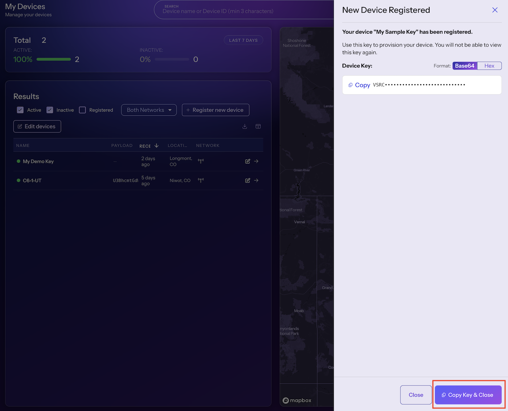
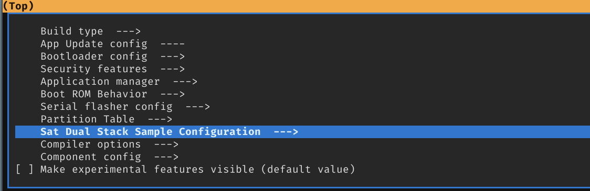
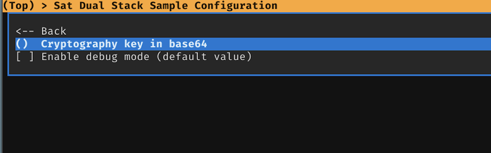
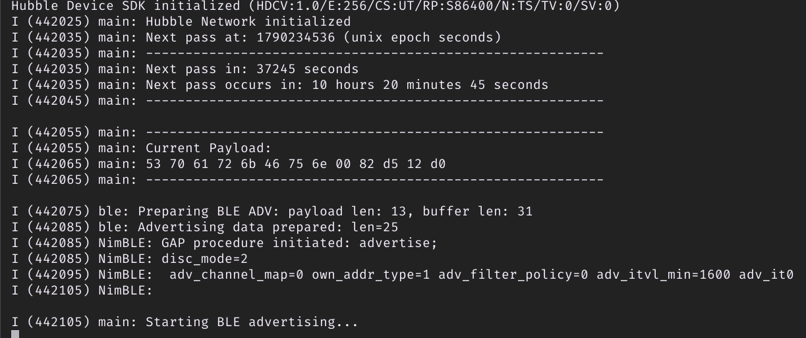
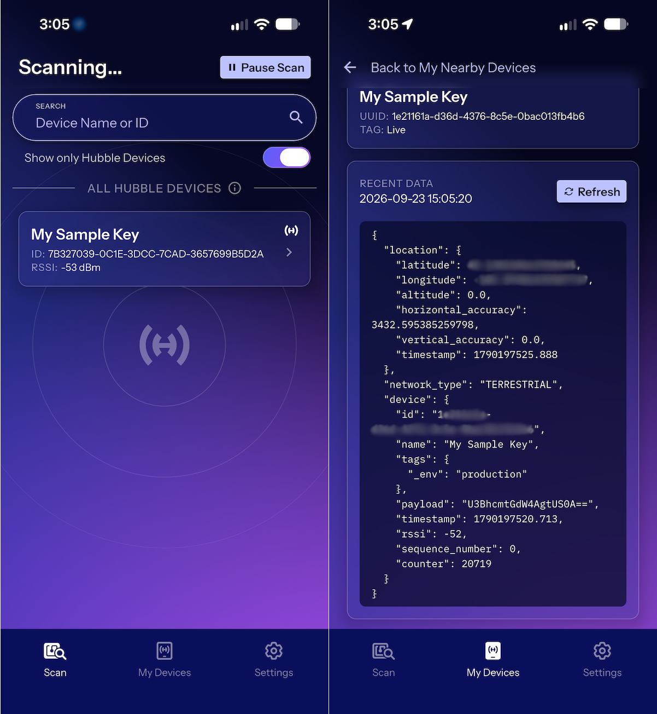
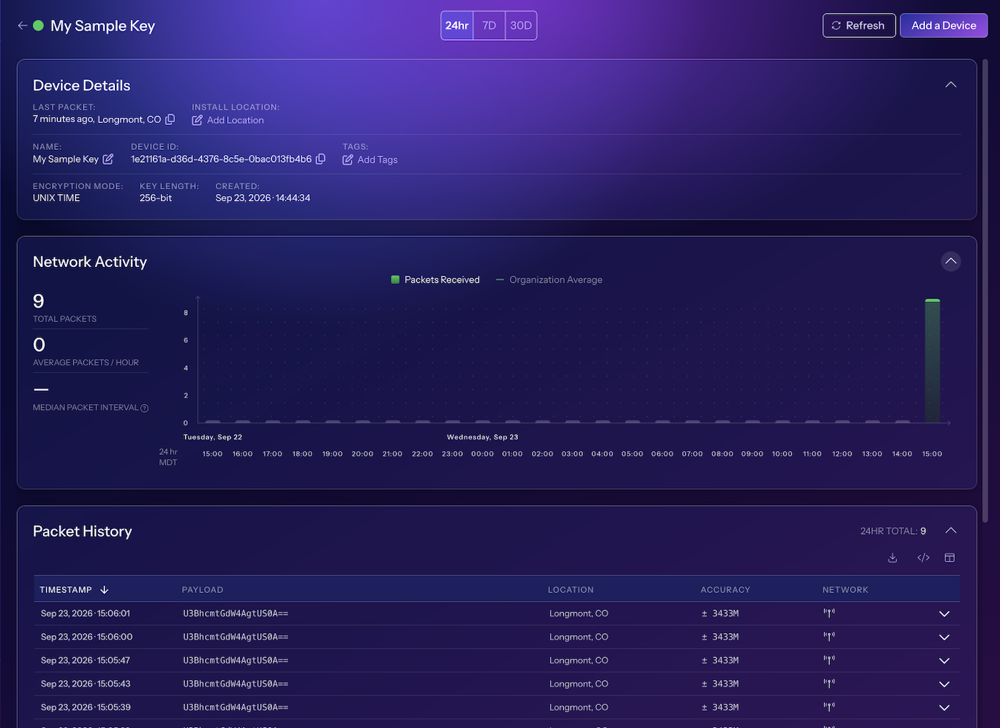
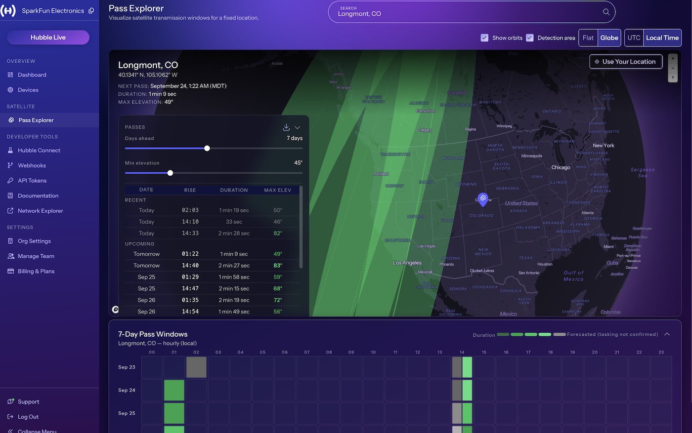

*Banner image*
# Using the Hubble Network with an ESP32-C6 Thing Plus

This document provides an example of how to setup and use a [SparkFun Thing Plus - ESP32-C6](https://www.sparkfun.com/sparkfun-thing-plus-esp32-c6.html) development board on the Hubble Network.
#### The Hubble Network

The Hubble Network provides a global visibility for any device with a Bluetooth chip - no modems, no infrastruction and most importantly, no custom hardware required. Utlizing both a terrestrial and satellite network, Hubble is able to over global coverage. And being based on standard Bluetooth hardware, delvier a solution a rapidly scalable solution at a low-entry cost.  
# A Simple Demo

The rest of this guide walks through the setup and deploy of a Hubble Network enabled device, using a [SparkFun Thing Plus - ESP32-C6](https://www.sparkfun.com/sparkfun-thing-plus-esp32-c6.html) development board. The demo will post an empty packet to both the Hubble terrestrial and satellite networks.

This demo is based on the [ESP-IDF Integration Guide](https://hubblenetwork.github.io/hubble-device-sdk/main/integration_guides/esp-idf/index.html#) from Hubble and the README.md](https://github.com/HubbleNetwork/hubble-device-sdk/tree/main/samples/esp-idf/sat-dual-stack#readme) in the Hubble SDK.
### Prerequisites

#### An ESP32-C6  Development Board

For this demo, a  [SparkFun Thing Plus - ESP32-C6](https://www.sparkfun.com/sparkfun-thing-plus-esp32-c6.html) - available at https://sparkfun.com

#### A Hubble Account

Sign up for a Hubble account at  https://hubble.com

#### A Hubble Account API Key

The Hubble API key is used to provision the demo device with satellite ephemeris (orbit parameters) data. This information is required to determine when to switch from Bluetooth (BLE) mode to satellite transmission.

## Development Setup

### Install the Espressif SDK/Framework

Install the Espressif `ESP-IDF` following the instructions in the Espressif [Getting Started Guide](https://docs.espressif.com/projects/esp-idf/en/latest/esp32c6/get-started/index.html) for your development platform. Install version 6.0 or above. 

### Install the Hubble SDK

The Hubble SDK is located on GitHub, and installed by just cloning the SDK's repository in your target development directory

```sh
git clone https://github.com/HubbleNetwork/hubble-device-sdk.git
```

### Install the Satellite PHY Libraries (ESP32-C6)

> [!IMPORTANT]
>  The Satellite Network module requires a PHY library blob from Espressif that is currently in Early Access (EA). The `libphy` shipped with ESP-IDF does **not** include this API yet and must be swapped in manually before building.

1) Download the ESPRESSIF PHY Libraries ZIP file  
	Download Link: [libphy_C6_20260317_c83212e.zip](https://dl.espressif.com/AE/libphy_C6_20260317_c83212e%20(2).zip)
	
2) Unzip and copy the extracted `*.a` files into your ESP-IDF installation:
   ```sh
	unzip "libphy_C6_20260317_c83212e.zip"
	cp libphy_C6_20260317_c83212e/*.a $IDF_PATH/components/esp_phy/lib/esp32c6/
   ```
This step is temporary. Once Espressif ships the API upstream, the blob swap will no longer be needed.

### Setup the IDF Environment

Verify your IDF Environment variables are setup. 

Note: IDF_PATH is the install location of the  `esp-idf`. 

```sh
source $IDF_PATH/export.sh
```

On a macOS:

```sh
source ~/.espressif/v6.0.2/esp-idf/export.sh
```

## Install Python Requirements

Device provisioning is performed by a Python script using Bluetooth to communicate with the device. To enable provisioning, install the required python components using the following command:

```sh
pip install -r ../../../../tools/requirements-companion.txt
```


## Create a Device Key

Log into your Hubble Account, which will place you on the Hubble Dashboard. 

Select the Devices section from the left side menu to list the current devices registered with Hubble. From here, select the `Add a Device` button on the upper right side of the panel.



On the presented dialog, select `I just need a Device Key` button (bottom, center of the panel).



In the presented dialog - set the following:

- Set a  device Name
- Select Unix Time for encryption mode.

The select the *Register Device* button.



In the presented dialog, copy the Device Key (Base64 encoding). 



Keep this key handy - you can never retrieve it again and it's used during device setup.

Close the dialog.
## Building the Example

Set your current working directory to the `sat-dual-stack` demo directory in the Hubble SDK.
```sh
cd $HUBBLE_DIR/samples/esp-idf/sat-dual-stack
```
Where HUBBLE_DIR is the install directory of the Hubble SDK.

#### Set the IDF target chip type to ESP32-C6:

```sh
idf.py set-target esp32c6
```

####  Configure the device key using *idf  menuconfig 

First, bring up the menuconfig interface:

```sh
idf.py menuconfig
```

Navigate to `Sat Dual Stack Sample Configuration --->` section, and select the `Cryptography Key in base64 (string)` entry. 


-


Enter the Hubble Device Key - created above. 

Save and exit.

#### Build and Flash the Example

Connect the  SparkFun Thing Plus - ESP32-C6 board to your system and issue the following command to build and flash the example to the board:

```sh
idf.py build flash monitor
```

Bring up a serial monitor/console to monitor the output from the device.

#### Provision the Device

The device is provisioned via a python script located in the `tools` folder of the Hubble SDK.

The script requires an Hubble API key to operate (to retrieve satellite parameter from Hubble). This is provided via the `HUBBLE_API_TOKEN` environmental variable.

You create an API via the Hubble Dashboard. Select the `API Tokens` entry on the left side menu of the panel, and then the *Create API Token* button on the upper right side of the panel.  

Once a token is created, copy it and set the HUBBLE_API_TOKEN variable to it. 

```sh
export HUBBLE_API_TOKEN=<your api token>
```

And then the provisioning script:

```sh
 python ../../../tools/dual-stack-companion.py
```

The python script will connect to the device via BLE, and transfer the satellite parameters and current time.

At this point, your device is running and broadcasting via BLE. 




Note - If the device is restarted, it will require provisioning. 

## Detecting a Device

The quick method to validate your device is operating quickly is to detect it using the Hubble App.

After the Hubble app is installed and logged into your Hubble account, you can scan for local devices. This will pick up the demo device:



And once detected, the received package will appear on your Hubble account dashboard, under the *Devices Section*.



### Transmit to Satellite 

The demo is set to transmit to a Satellite when a Hubble Satellite is overhead. When this occurs, the device should have clear access to the sky.

To have  better picture of an upcoming satellite pass, the Hubble Console provices a *Pass Explore*. 

On the left side of the console panel, select `Pass Explorer`, which presents a map and upcoming pass times and associated elevation from the horizon. 

Enabling a *Globe* and checking the *Show orbits* option, provides the current and near future pass information with in a map view. Zooming out gives a great view of a pass, as shown in the following image.



Once a pass completes, any recieved packets will appear in the Hubble Console after the data is downlinked from the satalite - within 6 hours.